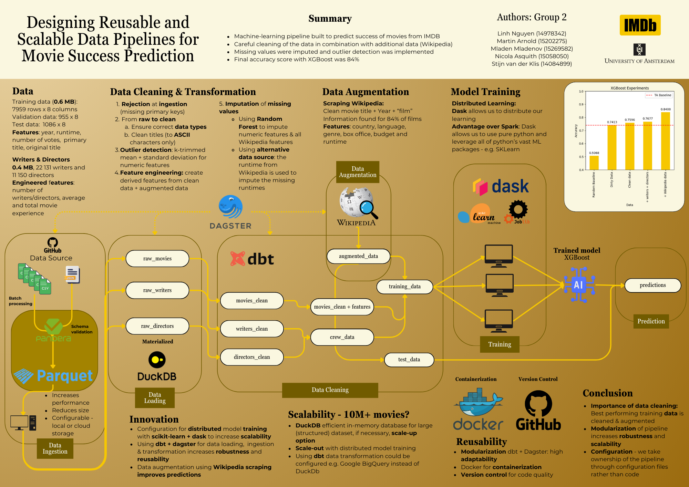

# Designing Reusable and Scalable Data Pipelines for Movie Success Prediction
#### Final project, *Big Data*, 2024, University of Amsterdam (UvA), Prof. Dr. Hazar Harmouch

Authors: Linh Nguyen, Martin Arnold, Mladen Mladenov, Nicola Asquith, Stijn van der Klis

## Table of contents

- [Repository structure](#repository-structure)
- [Problem statement](#problem-statement)
- [Data](#data)
- [Our approach](#our-approach)
- [Results](#results)

## Repository structure

- `./data` contains the data
- `./distributed_model_training` contains an (experimental) notebook using [Dask] (https://www.dask.org/) for distributed model training
- `./experiments` contains a notebook that measures accuracy for different levels of data cleaning and pre-processing (with XGBoost)
- `./ingestion` contains scripts to ingest data directly from the source
- `./media` some images
- `./prediction` submitted predictions
- `./tmdb_api` contains (experimental) notebooks to augment data with from the tmdb-api (was not used in the final predictions)
- `./utils` some command line utils
- `./wiki_data` scripts to scrape Wikipedia and augment data

Scripts are either Jupyter Notebooks or R scripts.

## Problem statement (from the assignment description)
Design, implement and evaluate an ML pipeline for a binary classification problem
on dirty, erroneous data. The goal in this project is to train a binary classifier to distinguish highly rated movies from low rated movies.

Submissions for this project will be shown on the [IMDB Leaderboard](http://big-data-competitions.westeurope.cloudapp.azure.com:8080/competitions/imdb).

The focus lies on the ML pipeline itself, less on the prediction accuracy, i.e. how reusable is your pipeline? 
A well-written ML pipeline should implement a sequence of data processing  operations to consume the input data, 
train the model and output predictions for the validation and test data. How innovative/efficient/stable are your data 
integration, cleaning and preparation operations? 

## Data
#### Training Data
The primary files contain an identifier, as well as title, release, runtime and voting information for several movies. 
The label column denotes whether a movie was highly rated or not.

`train-*.csv`

| tconst  |  primaryTitle | originalTitle | startYear | endYear | runtimeMinutes | numVotes | label |
|---|---|---|---|---|---|---|---|

In addition, there are two files that contain information about directors and writers of the movies.

`directing.json`

| tconst  |  director_id |
|---|---|

`writing.json`

| tconst  |  writer_id |
|---|---|

#### Validation & Test Data

We provide validation and test data as input for the submissions. This data has the same format as the training data, but does not contain the corresponding label.

`validation_hidden.csv` `test_hidden.csv`

| tconst  |  primaryTitle | originalTitle | startYear | endYear | runtimeMinutes | numVotes | 
|---|---|---|---|---|---|---|

## Our approach

## Results

